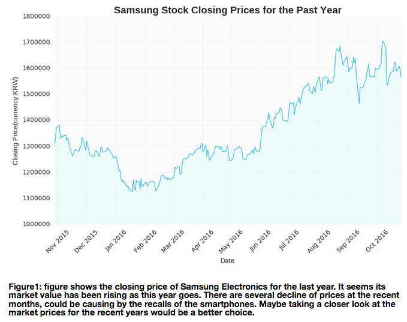

#HW7 Plot Review
### hc1924's plot
#### Review by Ben Alpert

###<b>Clarity:</b>
<i>Is the plot easy to read? is it clear or confusing, are the quantities being visualized ambiguous?</i>

###<b>Asthetic:</b>
<i>Beautiful is a subjective judgment: you should not judge the plot on the basis of whether you think it is "beautiful", but you should judge whether its esthetic is functional to what it is meant to communicate. Are the colors chosen appropriately? Are the graphical elements used appropriate to represent the quantities being visualized? Are the graphical choices allowing you to focus on the right elements or are they distracting you?</i>

###<b>Honesty:</b>
<i>Is the plot honestly reproducing the data or is it deforming it, perhaps to emphasize a point?</i>

###<b>Suggestions:</b>
